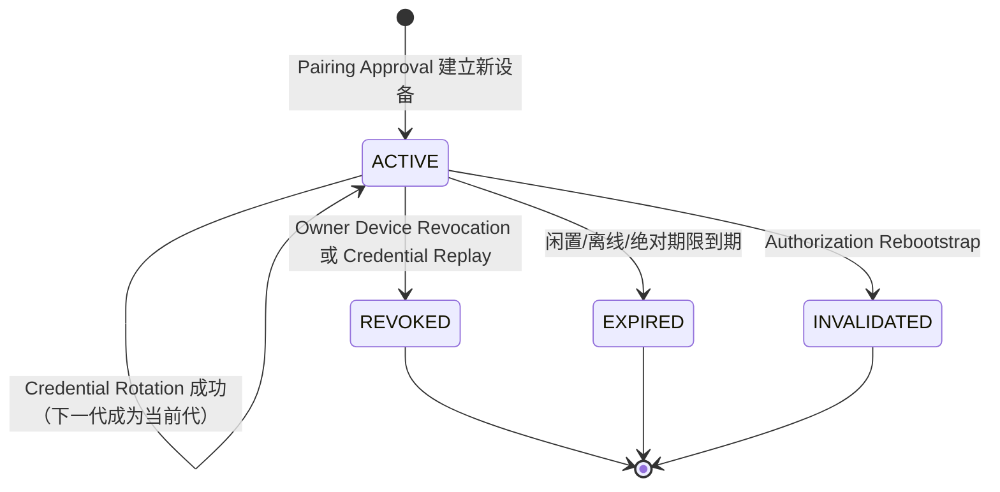

# 设备凭据链契约

> 状态：厂商无关的设计契约，不是正式认证接口、密钥格式、数据库模式或实现授权。领域含义以 [CONTEXT.md](../../CONTEXT.md) 与 [ADR-0032](../adr/0032-use-per-device-rotating-credential-families.md) 为准。本契约采用 OAuth refresh-token rotation 的安全原则作为参照，但 Cyrene 的正式领域名是 Device Credential，不引入 OAuth 登录、账号密码或匿名用户体系。

## 目的与安全依据

每个 Desktop Instance 或 Mobile Device 有且只有一条独立 Credential Family。Family 内在任意时刻最多一份当前 Device Credential；轮换把当前代原子地替换为下一代，重放退休代会撤销整条 Family。这样一台丢失或重装的设备不会影响其他设备，也不会凭旧秘密悄悄恢复身份。

RFC 9700 要求公开客户端的 refresh token 采用发送方约束或轮换，并要求访问令牌最小权限；V1 已明确暂不做设备私钥绑定，所以采用严格轮换、重放检测、平台安全存储与独立撤销的路线。[RFC 9700 §2.2](https://www.rfc-editor.org/rfc/rfc9700.html#section-2.2)、[RFC 9700 §2.3](https://www.rfc-editor.org/rfc/rfc9700.html#section-2.3)

## Family 与代际状态

| 范围 | 可以存在的资料 | 不得存在的资料 |
| --- | --- | --- |
| `ACTIVE` Family | 一个当前 Device Credential 的可验证哈希、退休代的最小重放检测资料、设备类别、最后授权使用时间、撤销版本和最小审计。 | 明文 Device Credential、共享设备凭据、LiveKit Token、E2EE 密钥或用户内容。 |
| 当前代 | 仅在该设备的平台安全存储与一次 HTTPS 认证请求中出现。 | URL、二维码、短码、`watch()` 字段、日志、审计、普通移动持久化或另一台设备。 |
| 退休代 | 仅为识别重放所需的不可逆验证资料；同一轮换幂等键的首次结果最多可在受保护的短暂内存窗口中重发 30 秒。 | 将明文 Device Credential 写入持久层、再次成为当前代、生成新的并行 Family、用于 LiveKit 或设备配对。 |
| 终态 Family | 面向设备的稳定重新配对/撤销结果和最小审计。 | 新 Access Token、媒体加入授权、延后生效的撤销或自动恢复旧身份。 |

## 轮换、重复与重放

1. 设备只可通过权威 HTTPS 使用其当前 Device Credential 发起 Credential Rotation；请求带设备本地生成的幂等键，凭据始终在请求认证头或等价的受保护体中传输，不在 URL 中传输。
2. 控制面以一个原子操作验证 Family 为 `ACTIVE`、当前代匹配、设备归属及期限仍有效，随后将下一代作为唯一当前 Device Credential 返回给该设备，并把旧代标为退休。不得在轮换前或轮换失败后提前使下一代有效。
3. 同一设备、同一轮换幂等键在 30 秒内重试时，只可重发**同一**首次结果；这不是签发第二个凭据、第二条 Family 或新设备。实现可安全地重导该结果或在受保护的短暂内存中保留可重发结果，但不得将明文 Device Credential 写入持久层；响应不能被日志、崩溃报告或审计记录。
4. 退休代在该窗口外、用不同幂等键或由不匹配的设备归属提交时是 Credential Replay。控制面原子地把 Family 标为 `REVOKED`，不猜测“哪个客户端更可信”，并返回不泄露凭据状态细节的重新配对结果。
5. Device Credential 轮换不等于 Pairing Challenge。重装、清除安全存储或凭据已经终态后，不能以旧 Family 轮换；新安装必须由现有桌面批准的新挑战建立新 Family。

## Access Token、过期与即时撤销

- Device Access Token 只授权权威控制面的 HTTPS 操作，最长 15 分钟；它不是 CloudBase transport token、LiveKit Token、Pairing Invitation 或 Media Join Grant。
- 每个受保护的控制面决定必须验证 Family 仍为 `ACTIVE` 或验证同等的撤销版本。仅检查签名与 15 分钟过期时间不够，因为那会把 Device Revocation 延后到 token 自然到期。
- `lastAuthorizedUse` 只在控制面成功接受当前 Device Credential、签发 Device Access Token 或完成 Credential Rotation 时更新；使用已有 Access Token 的请求、`watch()`、媒体保活、失败请求、单纯本地启动、后台重试和客户端时钟都不能续期。
- Mobile Device 自首次 Pairing Approval 起最多 1 年、或连续 180 天没有 `lastAuthorizedUse` 时进入 `EXPIRED`；Desktop Instance 不设绝对期限，但连续离线 180 天后进入 `EXPIRED`。终态设备必须重新配对。
- Owner Device Revocation、Credential Replay 和 Authorization Rebootstrap 立即停止该 Family 的轮换与 Access Token 使用，取消其待处理 Call Request，并按通话与 E2EE 契约结束关联 Voice Call / 移除媒体参与者。撤销桌面还会使其开放的 Pairing Challenge 失效。

## 可见性、审计与后续验收

- 桌面设备清单只公开设备类别、用户确认的显示标签、授权状态与最小时间信息；不能显示 Device Credential、哈希、重放原因、CloudBase 用户身份或媒体资料。
- Security Audit Event 只记录设备、Family 终态、轮换成功/拒绝、最小理由和时间，按 90 天边界删除；不得记录 credential、哈希、Access Token、幂等键、房间、Token、密钥或对话内容。
- 正式实现至少验证：两设备独立轮换；同键 30 秒内只返回同一结果；窗口外退休代重放只撤销其 Family；撤销后一个尚未过期的 15 分钟 Access Token 立即失效；移动 180 天/1 年与桌面离线 180 天的过期；重装必须走新配对；Authorization Rebootstrap 全量失效；以及所有日志、URL、二维码、`watch()`、审计与持久存储中均没有秘密。
