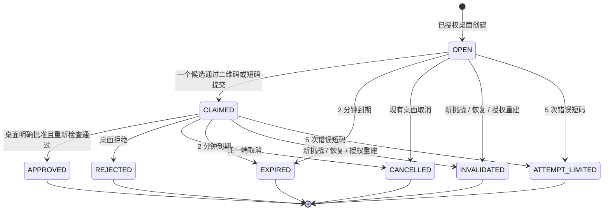

# 设备配对挑战契约

> 状态：厂商无关的设计契约，不是正式接口、数据库模式或实现授权。领域含义以 [CONTEXT.md](../../CONTEXT.md) 与 [ADR-0036](../adr/0036-require-desktop-approved-short-lived-device-pairing.md) 为准；本文只把已经确认的配对安全边界展开为后续规格与测试表面。

## 目的与非目标

Pairing Challenge 让一个新安装请求成为 Mobile Device 或 Desktop Instance，但二维码扫描、短码输入或校验码匹配都不能直接完成授权。它们只让一个 Pairing Candidate 到达现有桌面的审查界面；只有 Pairing Approval 才可能产生独立 Device Credential。

本契约不定义二维码编码、短码位数、密码学算法、数据库集合、CloudBase SDK 或 HTTP 路由。它不把 Owner Recovery Key、LiveKit Token、E2EE 密钥、Device Access Token 或任何现有 Device Credential 放进二维码、短码、校验码、日志或审计。

## 状态与终态

| 状态 | 可以拥有的东西 | 不能拥有的东西 |
| --- | --- | --- |
| `OPEN` | 一份 Pairing Invitation；一个目标设备类型；创建者 Desktop Instance。 | Pairing Candidate、长期授权、LiveKit/E2EE 资料。 |
| `CLAIMED` | 唯一 Pairing Candidate 的最少声明资料与 Pairing Verification Code，供现有桌面显示。 | Device Credential、Device Access Token、Owner 数据读取或呼叫能力。 |
| `APPROVED` | 已原子建立的新 Desktop Instance 或 Mobile Device，及只交给该新设备的一份独立 Device Credential。 | 可被另一个候选复用的挑战、共享凭据或历史二维码授权。 |
| 其他终态 | 面向双方的最小原因与最小审计事实。 | 任何新设备记录、凭据或可在稍后自动继续的队列。 |

一个 Pairing Challenge 最多绑定一个 Pairing Candidate。候选绑定不是授权：如果错误的人先扫到邀请，现有桌面只会看到候选资料并可拒绝或取消；不会产生可用设备或泄露 Owner 数据。需要换候选时创建新挑战，旧挑战进入 `INVALIDATED`。

## 建立、认领与批准

1. 只有当前已授权、未撤销的 Desktop Instance 可以创建挑战；创建时指定 `MOBILE` 或 `DESKTOP`，并检查创建桌面当前可管理该 Owner。每台桌面同一时间只允许一个 `OPEN` 或 `CLAIMED` 挑战；创建新的挑战会使该桌面的旧挑战 `INVALIDATED`。
2. 候选通过二维码或手动短码提交 Pairing Invitation 后，控制面只接受尚未到期、目标类型匹配且尚未绑定候选的请求。手动短码错误累计到 5 次时挑战进入 `ATTEMPT_LIMITED`；二维码路径不绕过桌面批准。
3. 成功认领后，候选只显示“等待桌面确认”，现有桌面显示候选的设备类型、最少可辨识标签和同一 Pairing Verification Code。该代码只用于人工发现错配；即使正确，也没有批准能力。
4. Pairing Approval 在控制面中是单个原子动作：重新验证批准者的 Device Credential、挑战仍为 `CLAIMED`、候选仍为同一安装、目标设备类型、3 台 Desktop Instance / 5 台 Mobile Device 上限和 Authorization Rebootstrap 状态。全部通过后，创建新设备和其独立 Credential Family，并把挑战写为 `APPROVED`；任一检查失败则不签发任何设备凭据。
5. 达到同类设备上限时，不自动撤销、替换或挤掉旧设备。批准动作只返回“先撤销同类设备”，不签发凭据也不自动重试；在挑战仍为 `CLAIMED` 且未到期时，用户可先撤销一台同类设备，再明确点击一次批准。容量腾出本身永远不能自动授权候选。

## 取消、失效与恢复边界

- 现有桌面或候选都可以取消；取消、拒绝、到期、短码尝试耗尽和批准成功均不可逆，之后所有重复动作只返回同一终态。
- Owner Recovery 撤销旧桌面时，旧桌面创建的开放/已认领挑战一律 `INVALIDATED`；Authorization Rebootstrap 使所有挑战、旧凭据和恢复密钥全部失效。
- 批准桌面在批准前被撤销、过期或失去 Owner 归属时，挑战不能被其他桌面静默接管或自动批准；新桌面须通过自己的明确挑战重新开始。
- 新设备在批准后才是 Desktop Instance 或 Mobile Device。卸载、清除安全存储或重新安装仍按既定规则视为新安装，必须再次走挑战；不从邀请、短码或旧候选记录恢复旧身份。

## 幂等、可见性与审计

- 同一候选对同一挑战的可重发提交只返回同一 `CLAIMED` 或终态；不同候选不得竞争性地获得第二份凭据。
- 桌面批准/拒绝、候选取消和超时相互竞争时，最先完成的终态获胜；后来操作只读回该终态，不能再签发凭据。
- 手机在获得正式 Device Credential 前看不到 Owner 的设备清单、Call Availability、角色名、呼叫状态或其他候选资料；桌面也不因候选提交而泄露长期秘密。
- Security Audit Event 只记录创建者、候选类型、结果和时间，按 90 天边界删除；不记录 Pairing Invitation、短码、校验码、Device Credential 明文、媒体凭据或任何对话数据。

## 后续验收场景

正式实现前后的测试至少覆盖：二维码与短码分别认领、短码 5 次错误、双候选竞争、创建第二个挑战使第一个失效、桌面拒绝、候选取消、2 分钟到期、桌面撤销期间批准、恢复/授权重建使挑战失效、达到 3/5 上限、批准双击幂等、重装后的新候选，以及日志/二维码/短码中不存在长期凭据或媒体资料。
