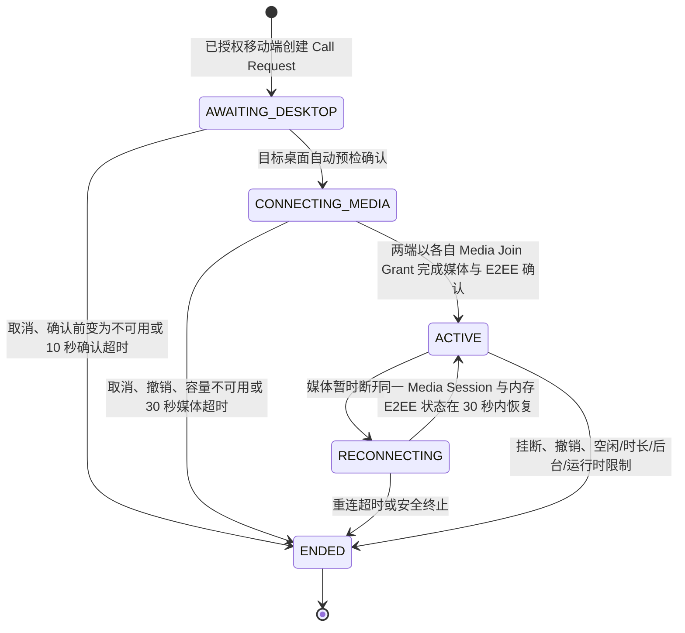

# 异地语音通话状态机契约

> 状态：厂商无关的设计契约，不是正式接口或实现授权。领域含义以 [CONTEXT.md](../../CONTEXT.md) 和 [ADR-0035](../adr/0035-use-one-immediate-idempotent-call-state-machine-across-clients.md) 为准；本文件把已确认的行为展开为后续测试表面。

## 适用范围

一通 `Voice Call` 始终由一个已授权 `Mobile Device` 请求一个 `Preferred Desktop`。它不排队、不广播、不抢占、不自动改呼；同一 `Owner` 最多一通。桌面一旦报告可用，V1 自动预检接听，没有额外的人工“接听”按钮；只要就绪检查、授权或计时条件不满足，就立即结束或拒绝。

这里的“立即拒绝”表示不创建可在桌面恢复后自动执行的 Call Request。它应向移动端显示可理解的原因，但不泄露桌面路径、模型配置、凭据或内部诊断。

## 阶段与唯一允许迁移

| 阶段 | 必须为真 | 可见含义 | 不能做什么 |
| --- | --- | --- | --- |
| `AWAITING_DESKTOP` | 已授权移动设备、唯一 Owner 通话槽与 Preferred Desktop 槽都已原子保留。 | “正在联系桌面”。 | 不签发媒体资料、不创建队列、不转向其他桌面。 |
| `CONNECTING_MEDIA` | 目标桌面仍就绪，且已对同一 Call Request 完成幂等确认；控制面只可为这两个指定端点创建各自的 Media Join Grant。 | “正在连接媒体”。 | 未确认 E2EE 前不能显示已接通，也不能把任一端的 grant 交给另一端。 |
| `ACTIVE` | 两端都已加入同一 LiveKit Media Session 并确认 E2EE。 | “通话中”，动态显示本次锁定的 Active Character 名称。 | 不能切换角色、改用其他桌面或复用房间/身份。 |
| `RECONNECTING` | 此前为 `ACTIVE`，只允许原移动设备和原桌面以仍在内存中的同一 Media Session 与 E2EE 状态尝试恢复原会话。 | “正在自动重连”。 | 不创建新 Call Request、不重新选桌面、不重新签发 grant 或密钥、不延长 30 秒窗口，也不重置连续空闲计时。 |
| `ENDED` | 已有一个 `Call Termination Reason`；任何参与者再次操作只得到同一终态。 | 显示终态原因。 | 不能恢复、重新加入或改变理由；新通话必须新建 Call Request。若已选媒体服务撤销尚未确认，只允许不可见的、fail-closed 的 Media Revocation Work Item 继续清理，绝不恢复电话或签发资料。 |

## 建立前检查与即时拒绝

移动端发起一次呼叫动作后，控制面在创建 Call Request 和 Voice Call 前按同一原子操作检查：

1. Mobile Device 的 Device Credential / Device Access Token 有效，未撤销、未过期、未处于 Authorization Rebootstrap 后的失效集合。
2. 该 Owner 没有 `AWAITING_DESKTOP`、`CONNECTING_MEDIA`、`ACTIVE` 或 `RECONNECTING` 的 Voice Call，也没有尚未得到媒体服务撤销确认的 Media Revocation Work Item。
3. 请求的 Preferred Desktop 仍归属于同一 Owner，且其 Call Availability 为可立即呼叫。
4. 成本保护没有拒绝新 Call Request。
5. 若已选媒体服务能在不创建会话、不中断既有通话且不新增计费的前提下提供权威容量结论，该结论没有指示 Media Capacity Protection；若服务只会在实际建立媒体时拒绝，控制面不得伪造预检，而是在 `CONNECTING_MEDIA` 中把该拒绝收束为终态。

移动端不在前台时只在本地提示“需保持前台”且不提交这一动作；已创建 Voice Call 后移动端连续后台 10 秒才进入 `BACKGROUND_TIMEOUT`。控制面任一检查失败时立即返回稳定的 Call Rejection Reason，不为该拒绝创建可等待、可恢复或可加入媒体的 Call Request / Voice Call。最小公开类别为：

| 类别 | 典型原因 | 结果 |
| --- | --- | --- |
| `DEVICE_NOT_AUTHORIZED` | 撤销、过期、重装后的旧凭据、授权重建。 | 要求重新配对；不暴露 Credential Family 细节。 |
| `DESKTOP_UNAVAILABLE` | 离线、未就绪、非首选桌面或桌面确认超时。 | 提示桌面当前不可接听；不自动改呼。 |
| `OWNER_BUSY` | 同一 Owner 的唯一通话槽已被占用，或上一通终态电话仍在等待媒体撤销确认。 | 提示忙线；不排队，也不暴露媒体服务失败细节。 |
| `COST_PROTECTION` | 达到 ¥50 月度保护线。 | 提示成本保护；不自动购买或重试。 |
| `MEDIA_CAPACITY_UNAVAILABLE` | 已选媒体服务在建立前已权威地表明免费或 Owner 已批准的容量不能开始新会话。 | 提示当前媒体容量不可用；不自动购买、升级、排队或改呼。 |

## 媒体容量保护与成本保护的边界

- `COST_PROTECTION` 只约束公网控制面的 ¥50 月度上限；它不是媒体服务的配额预测，也不能据此假定媒体已无余量。
- `MEDIA_CAPACITY_UNAVAILABLE` 只表达已选媒体服务实际拒绝新的会话容量。若在原子建立前可权威得知，返回同名 Call Rejection Reason；若只能在媒体建立中得知，已经创建的 Voice Call 立即进入 `ENDED`，仍使用同名的公开 Call Termination Reason。
- 这两类保护都不自动购买、提高套餐、排队、后台重试或改呼其他桌面。媒体容量变化也不主动结束一通已经 `ACTIVE` 的 Voice Call；只有该会话本身的真实媒体断开才适用既有的 `RECONNECTING` / `RECONNECT_TIMEOUT` 规则。
- 即使没有新媒体容量，Device Revocation、Owner Recovery、Authorization Rebootstrap、媒体撤销工作项和最小安全审计仍必须可执行。容量不可用不是跳过安全收束的理由。

## 终态理由与计时归属

下表只适用于已创建的 Voice Call：每个终态只写一个主 `Call Termination Reason`；可选的最小审计事实可以另记参与者与时间，不能把原始异常或秘密返回给另一端。

| 类别 | 终态理由 | 触发方与时限 |
| --- | --- | --- |
| 用户动作 | `CALLER_CANCELLED`、`PARTICIPANT_HUNG_UP` | 任一端取消/挂断；幂等。 |
| 桌面确认 | `DESKTOP_CONFIRM_TIMEOUT`、`DESKTOP_UNAVAILABLE` | 控制面从 `AWAITING_DESKTOP` 起计 10 秒。 |
| 媒体建立 | `MEDIA_CONNECT_TIMEOUT`、`E2EE_REQUIRED` | 控制面从桌面确认起计 30 秒；E2EE 缺失或失败绝不降级。 |
| 媒体容量 | `MEDIA_CAPACITY_UNAVAILABLE` | 已创建 Voice Call 后，已选媒体服务在建立中拒绝新的免费或 Owner 已批准容量；立即结束，不排队、不自动重试或购买。 |
| 媒体恢复 | `RECONNECT_TIMEOUT` | 从首次媒体断开起计 30 秒；控制面断线但媒体正常时不触发。 |
| 授权安全 | `DEVICE_REVOKED`、`AUTHORIZATION_REBOOTSTRAP` | Device Revocation 或授权重建立即把 Voice Call 置为终态、封住资料领取，并对两个媒体 identity 发起撤销；只有已选媒体服务确认后才记为媒体已停止。 |
| 运行时限制 | `BACKGROUND_TIMEOUT`、`IDLE_TIMEOUT`、`MAX_DURATION`、`RUNTIME_FAILURE_LIMIT` | 分别为移动端应用连续后台 10 秒、连续 10 分钟没有 Valid Voice Interaction、4 小时硬上限、同一运行时连续 3 次失败。 |

时间由权威控制面计量；手机和桌面只能显示倒计时或本地预测，不能用本机时钟延长确认、连接、重连或通话时长。

## 连续空闲的精确定义

- `ACTIVE` 起始时开始计时；每次 Valid Voice Interaction 都将权威 `lastValidVoiceInteractionAt` 更新为本次事件被控制面接受的时间，并据此重新计算 10 分钟截止点。
- 只有两类无内容事件能重置：Mobile Device 的本地有效说话检测，或 Desktop Instance 实际开始输出本次锁定 Active Character 的角色语音。控制面只接受当前 Voice Call 中、来自其既定端点且仍处于 `ACTIVE` 的事件。
- 音频/媒体包、LiveKit 或网络重连、`watch()`、运输层登录、Device Access Token 轮换、页面操作、麦克风权限变化、TTS 排队或生成成功但尚未输出，都不能重置。
- `RECONNECTING` 不暂停或重置该截止点；其独立的 30 秒媒体重连规则先行约束。若同一 Media Session 恢复后仍在 `ACTIVE`，继续使用原 `lastValidVoiceInteractionAt`，而不是把重连当作一次互动。
- 计时事件不携带音频、转写、文本、角色内容或 VAD 原始特征，只保留 Voice Call、端点类别与时间的最小审计事实。

## 幂等与并发契约

- 移动端为每个用户发起动作生成一个幂等键。相同 Mobile Device、相同键的重复发送必须回放同一 Call Request、同一 Voice Call 终态或同一 Call Rejection Reason，不能创建第二通。
- 不同键在 Owner 已占用时一律得到 `OWNER_BUSY`，不能抢占或替换前一通。
- 桌面自动确认使用 Call Request 的同一幂等标识；重复唤醒、重连或多次本地检查只能得到同一媒体连接结果。
- 取消、挂断、Device Revocation 和控制面强制结束彼此竞争时，最先完成的终态获胜；后来操作只读回该终态，不能重写理由或重启媒体。
- 进入 `ENDED` 立即使两端不能领取或重取 Media Join Grant；终态后的最小 Media Revocation Work Item 只用于向媒体服务撤销本通两个 identity，成功后删除映射。它不是第六个可见通话阶段，但在已选媒体服务确认前仍占用 Owner 的媒体安全槽；新的 Call Request 一律得到 `OWNER_BUSY`，而不是在未确认结束的媒体旁再开一通。
- Opaque Wake Signal 只促使桌面刷新权威状态，永远不能自身创建、确认、取消或结束通话。
- Desktop Suspension 会使新呼叫的 Call Availability 失效；对已经存在的 Voice Call，它只允许既有 `RECONNECTING` 在权威 30 秒窗口内沿用同一 Media Session 的内存状态恢复，不能创建或复活任何电话。详见 [桌面挂起与唤醒复核契约](desktop-suspension-reconciliation-contract.md)。

## 角色、媒体与最小数据不变量

- 桌面确认时锁定当时的 Active Character；之后角色切换受阻直到 `ENDED`。
- LiveKit Media Session 只在 `CONNECTING_MEDIA` 后由已认证的两端各自领取本端的 [Media Join Grant](e2ee-media-join-contract.md)；其中的短期 Token 与本次 E2EE 密钥不进入二维码、URL、数据库、审计、业务日志或持久移动存储。重连只能继续使用端点内存中的同一资料，不能借重连领取新 grant 或新密钥。
- Call Availability 只可以向已授权移动设备公开最小可呼叫状态与动态角色显示名；不公开角色内容、记忆、模型、ASR/TTS 诊断或桌面本机细节。
- Security Audit Event 只记录最小主体、阶段/理由和时间，90 天后删除；它不构成通话历史。
- 媒体撤销的房间/identity 映射只在 Cloud 确认前作为短时、fail-closed 的工作项存在；它不含 Token、E2EE key 或媒体，且不能在 `ENDED` 后形成新的加入资格。详见 [数据边界契约](public-control-plane-data-boundary-contract.md) 与 [LiveKit 撤销研究](livekit-token-revocation-and-immediate-device-revocation.md)。

## 后续验收场景

正式实现后，至少用内存 Adapter 和真实控制面 Adapter 各验证一次：同键双击、两台手机竞争、Preferred Desktop 离线、桌面刚转未就绪、10 秒确认超时、30 秒媒体超时、E2EE 失败、媒体建立中的容量拒绝、建立前可知的媒体容量拒绝、媒体 30 秒内恢复/超时、撤销期间通话、成本保护拒绝、移动端后台 10 秒、4 小时上限，以及“9 分 59 秒时有效说话/桌面角色语音重置、10 分钟纯静音结束、保活/UI/重连不重置”的空闲边界。每个场景都应同时验证移动端、桌面端、权威状态与最小审计的最终一致性。
