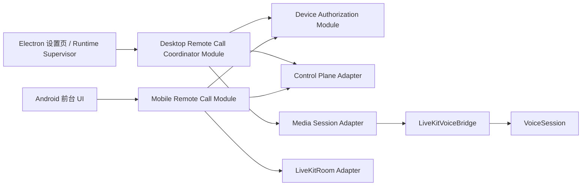

# 异地控制面：模块与接缝设计草案

> 状态：模块接缝已于 2026-07-23 获 Owner 明确授权开始实现。厂商无关的 Device Authorization Module、持久事务 Adapter、CloudBase 函数部署包、桌面批准界面和 Android 安全存储客户端已经完成本地验证；尚未部署 CloudBase 正式资源，厂商锁定仍受 [设计验收闸门](../validation/remote-voice-pairing-design-gates.md) 约束。

## 目的

把“设备授权与呼叫协调”的公网复杂性放在少数深 Module 后面，让既有 `VoiceSession` 继续只负责 ASR → 角色回复 → TTS，让 `LiveKitVoiceBridge` 继续只负责媒体。这样切换控制面 Adapter 或写测试时，不需要改动角色、语音轮次或 Electron 窗口逻辑。

## 当前代码事实

| 现有位置 | 当前职责 | 未来应保持/改变 |
| --- | --- | --- |
| [`VoiceSession`](../../src/main/call/voice-session.ts) | 已是深 Module：封装单次语音轮次、ASR、生成、TTS、取消与事件。 | 保持不感知 Owner、Device Credential、CloudBase、配对或 LiveKit Token。 |
| [`LiveKitVoiceBridge`](../../src/main/mobile-call/livekit-voice-bridge.ts) | 桌面端媒体 Adapter：用已给定的 `serverUrl`、桌面 Token、移动端身份连接 LiveKit，转发 PCM 与状态。 | 保持只接收本端当前 Media Join Grant；不得读取控制面 Secret 或决定谁有权通话。 |
| [`CallManager`](../../src/main/call/call-manager.ts) | 同时处理 Electron 适配、就绪检查、临时二维码、在本地签发 LiveKit Token 和启动媒体桥。 | 保留本机就绪检查与 `VoiceSession` 构造；移出本地签发远程媒体 Token、二维码即通话和远程呼叫仲裁。 |
| [`mobile/App.tsx`](../../mobile/App.tsx) 与 [`call-credentials.ts`](../../mobile/src/call-credentials.ts) | 扫描一次性深链，内存保存 LiveKit Token 并直接加入房间。 | 保留前台媒体 UI；正式路径改为已配对设备向控制面请求 Call Request，再领取本次媒体凭据。 |

现有二维码流程是本地开发/短时配对 Adapter，不能被扩展成长期设备授权：它把一次 LiveKit Token 放入深链，且由桌面本地的 LiveKit API Secret 签发。正式路线必须遵守 [ADR-0030](../adr/0030-let-only-the-public-control-plane-sign-livekit-tokens.md) 与 [ADR-0036](../adr/0036-require-desktop-approved-short-lived-device-pairing.md)。

## 推荐的接缝

### 1. Device Authorization Module

这是设备设置页、首次部署和恢复流程看到的深 Module。其 Interface 使用领域对象而不是 CloudBase 登录态或数据库文档：

```text
getAuthorizationSnapshot() -> 授权设备、上限、恢复密钥确认状态
beginPairing(kind) -> Pairing Challenge 的 Pairing Invitation（二维码/短码展示数据）
decidePairing(challenge, allow) -> 已批准/已拒绝/已过期的领域结果
revokeDevice(device) -> Device Revocation 的最终结果
recoverOwner(recoveryKey) -> Owner Recovery 的最终结果
```

它在内部处理 Device Credential 的安全存储、15 分钟 Device Access Token、轮换、重放检测、3+5 上限、最小审计和授权重建后的全量失效。调用方不接触凭据明文、Credential Family 状态或控制面传输 token。

`Device Authorization Module` 的生产 Adapter 是控制面 HTTPS；测试 Adapter 是内存授权账本。两者真实不同，因此此处是有效接缝，而不是只为抽象而抽象。

### 2. Desktop Remote Call Coordinator Module

这是登录后常驻的深 Module。Electron、Runtime Supervisor 与窗口只需要告诉它“本机是否可呼叫”并订阅其可显示状态：

```text
start() / stop()
setAvailability(Call Availability)
endCurrentCall(reason)
onStatus(listener) -> 只读状态快照
```

内部由它处理 Opaque Wake Signal、权威 HTTPS 刷新、一次性幂等确认、10 秒桌面确认、30 秒媒体连接、30 秒重连、4 小时上限、基于 Valid Voice Interaction 的连续空闲结束、撤销即时结束与审计。收到唤醒不等于收到来电：它必须先经 Device Authorization Module 获得有效短期授权，再查询权威 Call Request。这将 [ADR-0037](../adr/0037-use-content-free-wake-signals-before-authoritative-reads.md) 的安全规则集中在一个位置。

它依赖两个内部接缝：

- **Control Plane Adapter**：建立运输层订阅、刷新权威桌面工作项、确认或结束 Call Request、报告 Call Availability，并在确认后只为本端领取 Media Join Grant。CloudBase 是候选生产 Adapter；内存 Adapter 用于状态机测试。
- **Media Session Adapter**：只在内部接收本端 Media Join Grant，用它启动/结束一通 LiveKit Media Session 并在终态清除内存资料。既有 `LiveKitVoiceBridge` 是它的候选实现 Adapter；测试使用不传音频的 fake。

Coordinator 的公开 Interface 与 `onStatus` 不暴露 `watch()`、数据库集合、CloudBase transport token、LiveKit API Secret、E2EE key、Media Join Grant 或原始 LiveKit Token。grant 只能在 Coordinator 的内部控制流中从 Control Plane Adapter 直接交给 Media Session Adapter，不能经 Electron IPC、设置页、日志或状态快照流出。

### 3. Mobile Remote Call Module

Android 端的公开 Interface 保持面向用户的少量动作：

```text
restorePairedDevice()
requestCall(preferredDesktop)
cancelOrHangUp()
onStatus(listener)
```

它在内部持有移动端 Device Credential 的安全存储引用、获取 Device Access Token、创建幂等 Call Request、等待桌面确认，并在控制面允许后只把本端 Media Join Grant 直接交给现有 `LiveKitRoom` Adapter。面向 UI 的状态流不含 grant、Token 或密钥。移动端应用连续后台超过 10 秒即结束的 V1 规则也由该 Module 统一实施；不在本轮引入后台来电、排队或系统电话集成。

## 推荐的调用关系



`Control Plane Adapter` 可以向桌面发出无业务内容唤醒，但业务状态永远从权威读取返回；`Media Session Adapter` 只在 Call Request 已接受后得到端点独立、内存限定的 Media Join Grant。两条规则使传输层和媒体层都不能越过设备授权。

## 验证方式与迁移顺序

1. 先为三个 Module 写内存 Adapter 测试，覆盖配对批准/拒绝/过期、轮换重放撤销、单 Owner 一通、离线立即拒绝、撤销结束通话和所有计时终态。
2. 再实现控制面生产 Adapter，并以其 Interface 做真实大陆网络、即时撤销和成本验收；不要把这些测试塞进 `VoiceSession` 或 Electron IPC 测试。
3. 最后将当前二维码流程明确降级为开发/本地验证 Adapter。生产 Android UI 只使用 Mobile Remote Call Module，不解析持久化的 LiveKit 深链。

Owner 已将长期配对列为高优先级并明确要求继续推进，因此厂商无关 Module、HTTPS 合约、内存测试 Adapter 与 Android 安全存储可以在 CloudBase 观察期间并行实现。观察完成前仍不把内存 Adapter 当成生产控制面，不部署或锁定 CloudBase 数据结构，也不把测试通过声称为异地配对已可用；生产 Adapter 必须在候选锁定后实现同一公开 Interface。

## 首批实现证据（2026-07-23）

- `src/main/remote-access/device-authorization.ts` 已建立内存测试 Adapter：二维码认领只产生 Pairing Candidate；桌面批准后才建立独立设备和凭据；同一批准幂等；同一桌面新挑战使旧挑战失效；挑战 2 分钟到期；手动短码第 5 次错误终止；移动设备上限为 5；设备可独立撤销。
- Device Credential 只以高熵明文返回给获批候选，授权账本只保留 SHA-256 验证值。批准时不生成或持久化可恢复的凭据副本；候选领取结果时，以其未持久化的高熵 Candidate Receipt 和获批 Device ID 通过带领域分隔的 HMAC 确定性派生本机凭据，因此响应丢失后的同一候选重试仍得到同一值，而数据库中的 Candidate Receipt 哈希和 Device Credential 哈希不能重建明文。桌面创建、候选认领、桌面审查和批准结果都不含 Device Credential。
- `src/main/remote-access/device-authorization-http.ts` 固定 `/v1/pairing/begin`、`claim`、`review`、`decide` 与 `outcome` 的厂商无关 HTTPS 语义；二维码仅含控制面 HTTPS Origin、挑战 ID、Pairing Invitation 和到期时间。桌面 `review` 只返回候选最小标签、类型、校验码与终态，不返回候选回执或 Device Credential。
- `mobile/src/device-authorization-store.ts` 使用 Expo SecureStore 保存安装实例 ID 与获批凭据；Android 由 Keystore 加密并排除不可恢复的自动备份，卸载或清除安全存储后按新实例重新配对。
- `mobile/src/device-pairing.ts` 已实现邀请解析、候选认领、校验码等待、批准结果领取与获批后安全保存；`mobile/App.tsx` 已区分长期配对二维码与 Beta 0 通话二维码，并提供等待校验码及已配对状态。由于没有生产控制面可调用，当前仍不能完成真实长期配对。
- `src/main/remote-access/desktop-device-credential-vault.ts` 已建立桌面凭据安全存储 Adapter：macOS 通过 Electron `safeStorage` 使用系统 Keychain 设备绑定加密，磁盘只保存 `0600` 密文；安全存储不可用时拒绝持久化，不降级为明文或可逆混淆。读取损坏文件只返回 `corrupt`，不向 UI 暴露部分凭据。
- `src/main/remote-access/desktop-device-authorization-client.ts` 已建立桌面 HTTPS 客户端：Device Credential 只在主进程内从安全存储读取并进入 `Authorization` 请求头；公开结果只有本机配对状态、Pairing Invitation 展示资料、待审候选、校验码和批准终态。
- `src/main/remote-access/persistent-device-authorization.ts` 已把同一领域 Module 放入可替换的单 Owner 聚合事务；独立函数实例可以依次创建、认领、批准和领取，两个并发批准仍只得到同一个幂等结果。挑战进入批准或拒绝终态时会删除邀请哈希、短码哈希与校验码，持久状态不包含 Device Credential 明文或加密副本。
- `src/main/remote-access/cloudbase-device-authorization-store.ts` 与 `cloudbase-device-authorization-function.ts` 已实现本地可测试的 CloudBase 生产 Adapter：一个事务读取并写回单 Owner 小型授权聚合文档，HTTP 网关入口限制为 JSON、16 KiB 请求体和 `no-store` 响应。`cloudbase/device-authorization` 已形成 Node 20 CommonJS 部署包并锁定 `@cloudbase/node-sdk` 依赖；它复用 CloudBase 的 `runTransaction` 数据库能力与[标准 HTTP 网关事件](https://docs.cloudbase.net/service/access-cloud-function)，但尚未部署到用户环境。
- 首次 Owner 初始化与 Owner Recovery 已进入同一原子聚合：只有空环境和高熵 Deployment Bootstrap Code 的 SHA-256 验证值匹配时，才会创建首台桌面。首台桌面的 Device Credential 与 Owner Recovery Key 都只在成功响应中出现一次；数据库只保存验证哈希。恢复密钥确认前禁止新增桌面，错误引导码和重复初始化均失败。恢复只在所有桌面 45 秒可用性租约失效后允许；它撤销旧桌面、使未终态挑战失效、保留手机并标记重新审查，随后立即轮换恢复密钥。同一恢复回执可幂等重领相同结果，旧密钥的不同回执重放失败。设置页把新 Device Credential 从主进程直接写入 macOS 钥匙串，Renderer 只短暂显示替代恢复密钥并随机指定 4 个正文字符供用户从外部副本确认；确认或取消都会清除页面明文。`DesktopAvailabilityCoordinator` 已实现清醒时 30 秒续租、挂起/退出清除和唤醒后显式恢复；旧桌面通话即时终止仍待 Remote Call Coordinator 接入。
- `src/main/remote-access/device-pairing-ipc.ts` 已将长期配对接入 Electron 主进程和设置页。Renderer 只得到二维码图片、备用短码、候选显示标签、设备类型、校验码和批准终态；原始 Pairing Invitation、Candidate Receipt 和 Device Credential 均不进入 IPC。设置页已提供明确的“允许这台手机”和“拒绝”操作，并与 Beta 0 手动二维码通话分区。

## 迁移清单（只读盘点）

以下现有文件属于本地短时二维码 Adapter，正式迁移时应按职责替换，而不是把它们继续扩展成长期配对：

| 现有位置 | 当前行为 | 正式迁移后的处理 |
| --- | --- | --- |
| [`livekit-call-credentials.ts`](../../src/main/mobile-call/livekit-call-credentials.ts) | 桌面本地用 LiveKit API Secret 直接签发手机和桌面 Token，并放入短时深链。 | 保留为开发/本地验证 Adapter 或移除；生产 Remote Call Coordinator 不得调用它。 |
| [`call-manager.ts`](../../src/main/call/call-manager.ts) 的 `startMobileCall` | 同时创建房间、启动媒体桥并返回二维码。 | 拆成“本机就绪检查”和“按本端已确认的 Media Join Grant 启动 `LiveKitVoiceBridge`”；Call Request、Token 签发与配对移至深 Module。 |
| [`index.ts`](../../src/main/index.ts) 的 `mobileCallLiveKitApiSecret` 设置 | Electron 设置页持有本地 LiveKit API Secret，并通过 IPC 触发二维码流程。 | 生产设置页删除该 Secret 的可编辑入口，改为设备/控制面状态；只保留显式开发模式才可使用本地 Adapter。 |
| [`mobile/src/call-credentials.ts`](../../mobile/src/call-credentials.ts) | 解析 `cyrene://call` 中的 LiveKit Token。 | 限制为开发深链测试；生产 Android 只能从已认证控制面直接拿到本端、仅限本通电话的内存 Media Join Grant。 |
| [`LiveKitVoiceBridge`](../../src/main/mobile-call/livekit-voice-bridge.ts) | 用传入的桌面 Token 与移动端身份连接媒体房间。 | 保持为 Media Session Adapter；只将配置来源换为控制面已确认的桌面 Media Join Grant。 |

迁移后的测试必须断言：生产路径从 Electron 设置、二维码图片、日志、URL 和移动端持久存储中均找不到 LiveKit API Secret、原始 LiveKit Token 或 E2EE 密钥；当前本地二维码测试不可以被拿来证明该生产性质。
